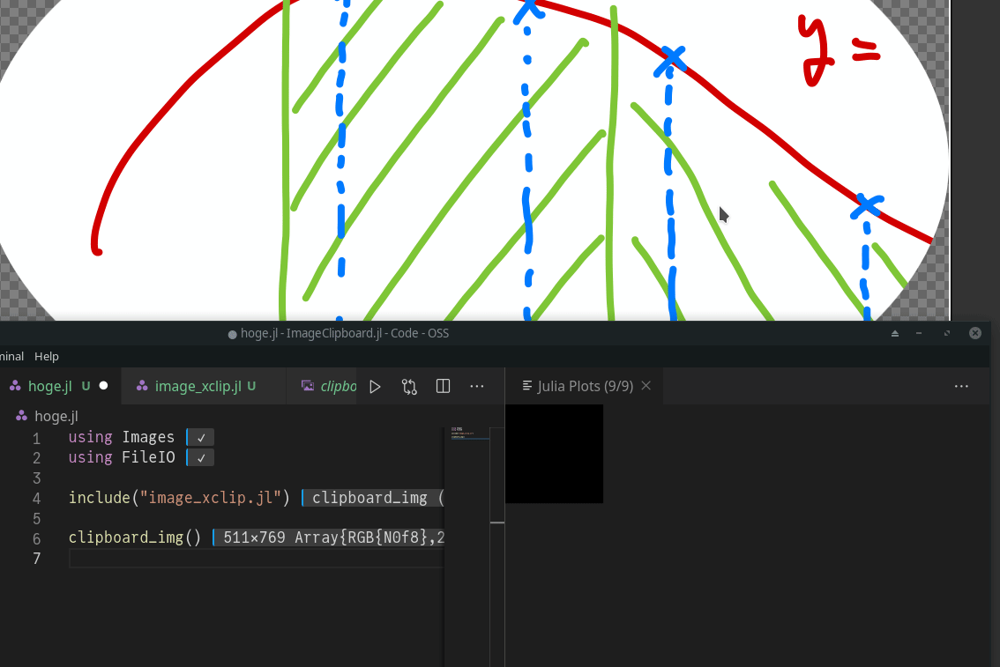

# ImageClipboard.jl

[](https://hyrodium.github.io/ImageClipboard.jl/stable)
[](https://hyrodium.github.io/ImageClipboard.jl/dev)
[](https://github.com/hyrodium/ImageClipboard.jl/actions)

Copy & Paste images with Julia

## Install
```
(@v1.6) pkg> add https://github.com/hyrodium/ImageClipboard.jl
```

## Usage
```julia
using Images, ImageClipboard

# Create random image
img = rand(RGB{N0f8}, 100, 200)

# Copy to clipboard
clipboard_img(img)

# Paste image from clipboard
img2 = clipboard_img()

# These are the same images
img == img2
```

## Sample screenshots (old)



